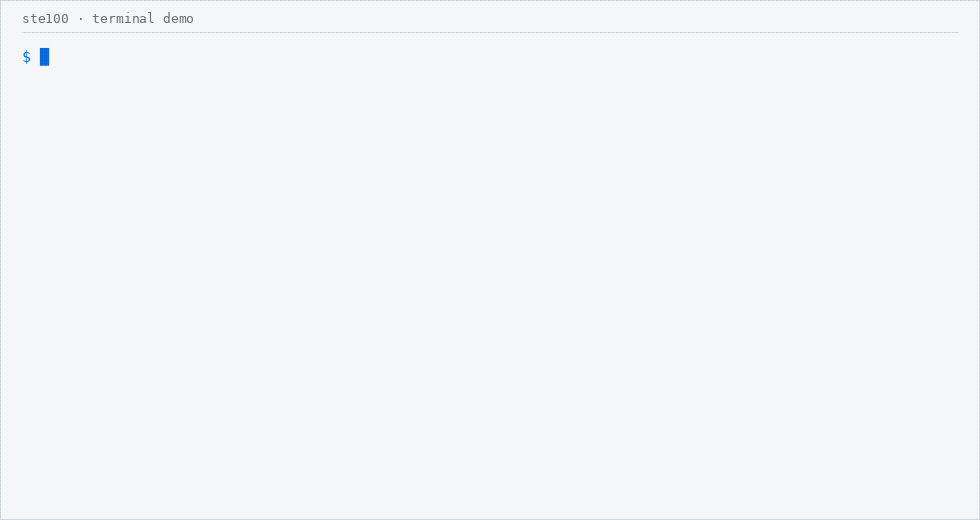
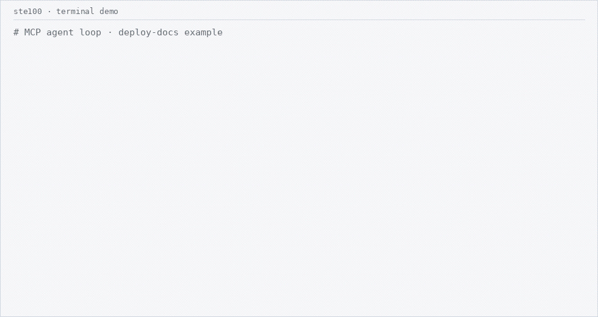

# asd-ste100-checker

An open-source **Simplified Technical English (ASD-STE100)** writing checker
for LLM coding agents — thin skill + MCP + LSP over a deterministic Python
engine.

[](https://github.com/sourdough-bread/asd-ste100-checker/actions/workflows/ci.yml)
[](LICENSE)
[](https://www.python.org/downloads/)

## What changes

| Before | After |
| --- | --- |
| Three viable paths, in order of robustness, can be leveraged to facilitate deployment: implement containerized delivery so CI builds and pushes an image and the runtime pulls it; restore the pre-built environment and align infrastructure with the pipeline; or at minimum ensure that templates are synchronized and readiness is polled rather than slept. | Deploy the app with a container image.<br>1. Build the image in CI.<br>2. Push the image to the registry.<br>3. Configure the app to pull that image.<br>4. Do not install packages when the app starts. |
| Findings include `STE-VOCAB-UNAPPROVED`, `STE-SENTENCE-LENGTH`, `STE-PASSIVE` (and related). | Short imperative steps — one action each. Recheck with `ste100 check`. |

## Watch the loop

CLI check → rewrite → recheck:



Agent MCP tool loop on the same example (check → rewrite brief → host rewrite → recheck):



> **Unofficial** — not affiliated with, endorsed by, or sponsored by ASD.
> Full trademark / compliance notice: [Disclaimer](#disclaimer).

## 30-second try

```bash
uvx --from asd-ste100-checker ste100 setup
uvx --from asd-ste100-checker ste100 check docs/fixtures/before.txt --text-type procedure
uvx --from asd-ste100-checker ste100 check docs/fixtures/after.txt --text-type procedure
```

## Install

### Consumers (recommended)

```bash
# One-time spaCy model in the environment that will run the checker
uvx --from asd-ste100-checker ste100 setup
# equivalent: python -m ste100 setup   (after pip install)
```

Then point Cursor at `uvx` (see [`.cursor/mcp.json.example`](.cursor/mcp.json.example)):

```json
{
  "mcpServers": {
    "ste100": {
      "command": "uvx",
      "args": ["--from", "asd-ste100-checker", "ste100", "serve"],
      "env": {
        "STE100_SPACY_MODEL": "en_core_web_sm",
        "STE100_WORKSPACE": "/absolute/path/to/your/project"
      }
    }
  }
}
```

Or with a local venv: `"command": "python", "args": ["-m", "ste100", "serve"]`.

`ste100 doctor` is **check-only** (no network). `ste100 setup` / `ste100 doctor --fix`
may download the configured spaCy model.

### Developers (editable)

```bash
pip install -e ".[dev]"
python -m ste100 setup
```

### Docker (HTTP MCP)

Minimal image: package + baked `en_core_web_sm`, listens on `0.0.0.0:8765`.
Requires `STE100_MCP_TOKEN` at runtime. Text/payload tools work; host git /
relative filesystem checks are not the Docker story.

```bash
docker pull ghcr.io/sourdough-bread/asd-ste100-checker:latest
docker run --rm -e STE100_MCP_TOKEN='replace-me' -p 8765:8765 \
  ghcr.io/sourdough-bread/asd-ste100-checker:latest
```

Images and PyPI packages publish on tagged releases (`v*`) once OIDC trusted
publishing (PyPI) and GHCR permissions are configured. This repo does not push
tags for you — create a GitHub release / push a `v*` tag when ready.

<details>
<summary>spaCy model</summary>

Default model: `en_core_web_sm`.

Override with either:

- Environment: `STE100_SPACY_MODEL=en_core_web_md` (also used by the MCP server
  — set it **before** `ste100 serve`; check tools do not take a model param)
- CLI: `ste100 check --spacy-model en_core_web_md path/to/manual.txt`

`serve` **eagerly** loads the model at startup and exits with a setup hint if it
is missing (no runtime auto-download inside MCP tool calls).

CI and the default install stay on `en_core_web_sm`.

</details>

<details>
<summary>Path resolution (MCP)</summary>

- **Absolute** paths are used as-is (`ste_check_file`, glossary args).
- **Relative** paths require `STE100_WORKSPACE` (absolute workspace root).

</details>

## Quickstart

### CLI

```bash
# Environment check (no network)
ste100 doctor

# Install spaCy model if missing
ste100 setup

# Check a file (JSON output by default)
ste100 check path/to/manual.txt

# SARIF output
ste100 check path/to/manual.txt --output sarif

# Force a text type instead of auto-detection
ste100 check path/to/manual.txt --text-type procedure

# Check only locally changed doc files (working tree vs HEAD)
ste100 check-changed
ste100 check-changed --glob '*.md' --glob '*.txt' --output json

# Branch-vs-base (merge-base of HEAD and the named ref)
ste100 check-changed --base main

# Read from stdin
cat manual.txt | ste100 check -
```

### MCP server (stdio)

Prefer `uvx` as above, or:

```json
{
  "mcpServers": {
    "ste100": {
      "command": "ste100",
      "args": ["serve"],
      "env": {
        "STE100_SPACY_MODEL": "en_core_web_sm",
        "STE100_WORKSPACE": "/absolute/path/to/your/project"
      }
    }
  }
}
```

### MCP server (HTTP / streamable)

Default bind is **localhost** for demos. HTTP requires a shared bearer token:

```bash
export STE100_MCP_TOKEN='replace-me'
ste100 serve --transport http --host 127.0.0.1 --port 8765
# endpoint: http://127.0.0.1:8765/mcp
# clients: Authorization: Bearer replace-me
```

Cursor / remote HTTP config sketch:

```json
{
  "mcpServers": {
    "ste100-http": {
      "url": "http://127.0.0.1:8765/mcp",
      "headers": {
        "Authorization": "Bearer replace-me"
      }
    }
  }
}
```

Also accepted: `--transport sse` or `--transport streamable-http`.
Stdio transport does **not** require `STE100_MCP_TOKEN`.

### LSP (diagnostics only)

```bash
ste100 lsp
```

Filetypes: `md`, `txt`, `rst`, `adoc`. On open/change/save the server runs
`analyze()` and publishes LSP diagnostics (severity + range from Finding
offsets). **No code actions.**

Generic language-client stub (Cursor / VS Code style):

```json
{
  "languageServerExample.server": {
    "command": ["ste100", "lsp"],
    "languages": ["markdown", "plaintext", "restructuredtext", "asciidoc"]
  }
}
```

### MCP tool catalog

- `ste_check_text(text, text_type="auto", glossary=None, output="json")`
- `ste_check_file(path, text_type="auto", glossary=None, output="json")`
- `ste_lookup_word(word)`
- `ste_explain_finding(rule_id)`
- `ste_apply_safe_fixes(text, glossary=None)`
- `ste_suggest_rewrite(...)` — prompt-return rewrite brief; **no LLM API in MCP**
- `ste_suggest_semantic_review(...)` — Tier-3 brief; **no LLM API in MCP**
- `ste_check_changed_files(globs=None, text_type="auto", glossary=None, output="json", base=None)` —
working tree vs `HEAD`, or vs `git merge-base HEAD <base>` when `base` is set

## Edge-case gate

Corpus: `[tests/edge_cases/cases.json](tests/edge_cases/cases.json)` (E01–E20 engine,
W01–W10 workflow).

```bash
# Engine cases (CI)
pytest tests/test_edge_cases.py -q

# Workflow contracts + gate_report (agent/manual; no provider LLM required)
python scripts/run_skill_gate.py
# → tests/edge_cases/gate_report.md
```

Subagent instructions: `[tests/edge_cases/SUBAGENT_PROMPT.md](tests/edge_cases/SUBAGENT_PROMPT.md)`.
The skill-subagent gate is **manual/agent** after platform changes; CI runs pytest
only.

## Tier-2 syntax rules


| Rule ID            | STE mapping     | Scope     | Notes                                                                                          |
| ------------------ | --------------- | --------- | ---------------------------------------------------------------------------------------------- |
| `STE-PASSIVE`      | Rule 3.6        | procedure | Verbal passive; adjective participles (Rule 3.3) are not flagged. Descriptive text is skipped. |
| `STE-IMPERATIVE`   | Rule 5.3        | procedure | Numbered / list steps should be imperative.                                                    |
| `STE-VERB-FORM`    | Rules 3.2 / 3.4 | both      | Progressive, perfect, modal+passive stacks.                                                    |
| `STE-NOUN-CLUSTER` | Rule 2.1        | both      | Multi-word nouns longer than **3** words.                                                      |


**Severity policy (candidate-aware):** high-confidence parses → `error`;
lower-confidence / fragment-like → `warning`. Each finding’s `evidence`
includes `confidence`, `parse_cue`, `text_type`, and `rule_ref`.
`compliant` is still `true` only when there are no ERROR findings.

## Tier-3 semantic rules (hybrid)


| Rule ID              | Scope       | Default severity             | Notes                                                                             |
| -------------------- | ----------- | ---------------------------- | --------------------------------------------------------------------------------- |
| `STE-PRONOUN-AMBIG`  | both        | WARNING                      | Ambiguous `it` / `this` / `these` / `those` / `they`.                             |
| `STE-TOPIC-SENTENCE` | description | WARNING                      | Weak openers (pronoun/demonstrative start, fragment, coordination, meta-comment). |
| `STE-POS-MISMATCH`   | both        | WARNING (ERROR if high-conf) | Approved dictionary POS vs spaCy usage; skips TN/TV and unapproved.               |


## Disclaimer

> **Unofficial — not affiliated with, endorsed by, or sponsored by ASD.**
> ASD-STE100 is a registered European Union Trade Mark (No. 017966390).
> This project is an independent tool and makes no claim of official compliance
> or certification.

## Dictionary data and redistribution

The STE dictionary and rule metadata are **extracted from the official PDF**
(`ASD-STE100-ISSUE-9.pdf`, Issue 9, January 2025) and committed to this repo as
`ste100/dictionary/data/dictionary.json` and `ste100/dictionary/data/rules.json`.

By using this project you acknowledge and accept the redistribution risk
associated with committing this derived data. This project is independent and
unofficial; it is not affiliated with, endorsed by, or sponsored by ASD, and
ASD-STE100 is a registered European Union Trade Mark (No. 017966390).

## Architecture

Four surfaces on one deterministic engine:

1. **Agent skill** (`skill/`) — workflow for LLM coding agents (no logic of its own).
2. **MCP server** (`ste100/mcp/`) — stdio or HTTP/SSE FastMCP tools → engine.
3. **LSP** (`ste100/lsp/`) — diagnostics-only Finding → `publishDiagnostics`.
4. **Engine** (`ste100/`) — analyzer, rules, dictionary, serializers. No LLM calls.

```
LLM agent (skill)  ->  MCP (stdio|HTTP)  ->  deterministic engine
Editor             ->  LSP (stdio)       ->  deterministic engine
```

## Packaging

Installable via setuptools (`pip install` / `uvx asd-ste100-checker`). Metadata
is PyPI-ready. Tagged releases (`v*`) publish the wheel/sdist to PyPI (OIDC
trusted publisher preferred) and the Docker image to
`ghcr.io/sourdough-bread/asd-ste100-checker`. Configure the PyPI trusted
publisher for this GitHub repo before the first tag, or set `PYPI_API_TOKEN`.

## License

Apache-2.0. See [LICENSE](LICENSE). See also [CHANGELOG.md](CHANGELOG.md).
